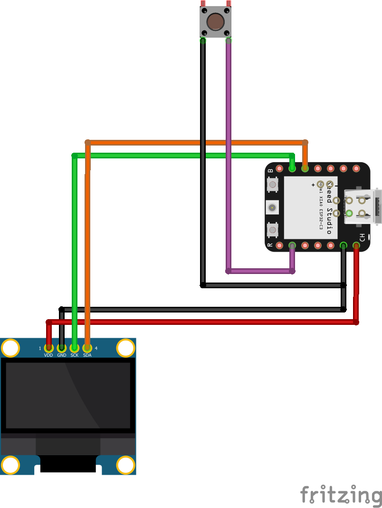
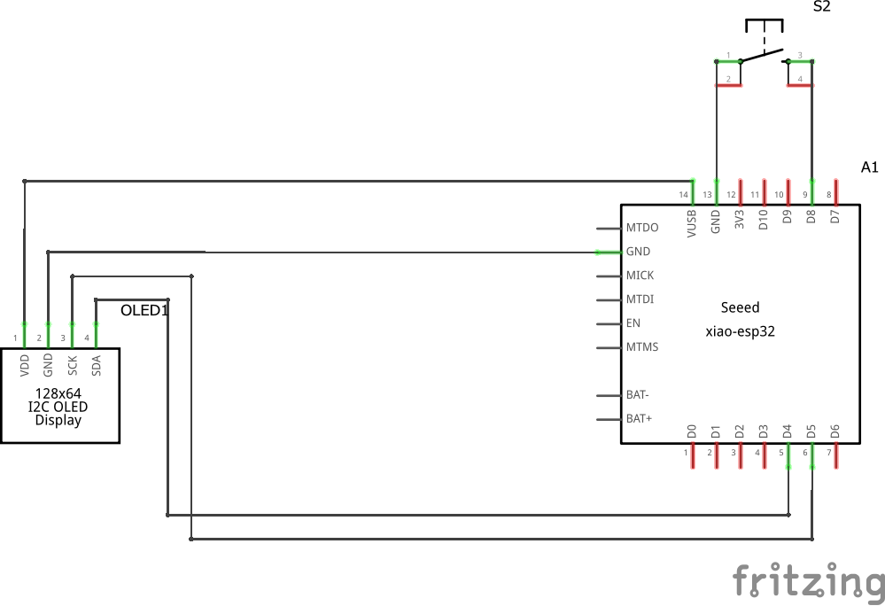

# Waktu Solat (Prayer Time) ESP32 Monitor

:alembic: **This project is still under development.**

Displaying Malaysia prayer time on a embedded system so you can be alerted anytime when the azan time comes.

## Hardware

- [Seeed XIAO ESP32C3](https://my.cytron.io/p-seeed-xiao-esp32c3?ref=99Y7TxrNIn6Jo)
- OLED Display 128x64 SH1106 (I2C)

## Software

- Visual Studio Code with [extension for Arduino](https://marketplace.visualstudio.com/items?itemName=vsciot-vscode.vscode-arduino) _(Of course you can still use the regular Arduino IDE)_

## Libraries

- Adafruit GFX Library - https://github.com/adafruit/Adafruit-GFX-Library
- Adafruit SH110x - https://github.com/adafruit/Adafruit_SH110x (Depends on your OLED display controller)
- TimeLib - https://github.com/PaulStoffregen/Time

## Circuit diagram

Visual

Schematic

## Faces

### Simple

